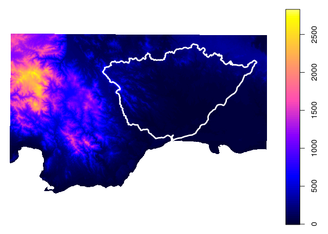
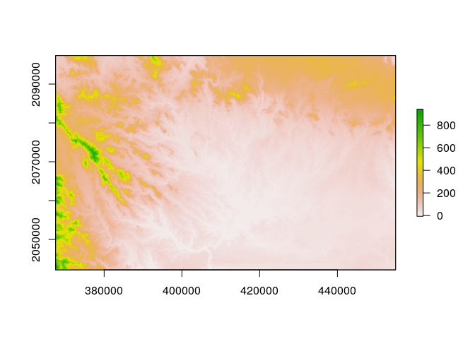
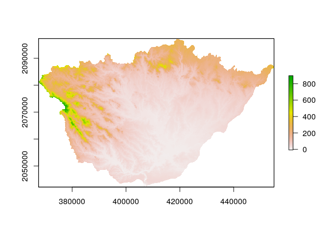
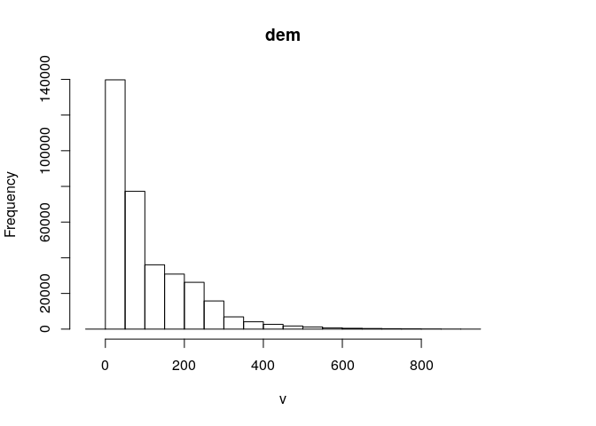
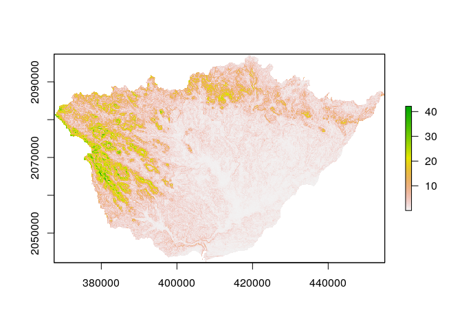
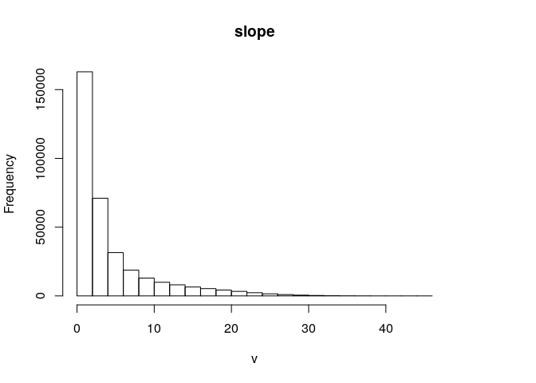
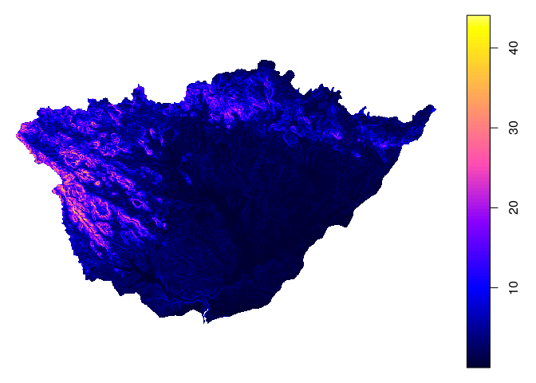

Calcular parámetros hidrográficos
================
Edel Tejada
21 de noviembre, 2020

``` r
## Proceso 0
library(rgrass7)
```

    ## Loading required package: XML

    ## GRASS GIS interface loaded with GRASS version: (GRASS not running)

``` r
library(sf)
```

    ## Linking to GEOS 3.8.0, GDAL 3.0.4, PROJ 7.0.0

``` r
library(raster)
```

    ## Loading required package: sp

``` r
library(sp)

## Primera Ejecucion (Diretorio de la region)
gisdbase <- 'grass-data-test' #Base de datos de GRASS GIS
wd <- getwd() #Directorio de trabajo
wd
```

    ## [1] "/home/edelte/unidad-0-asignacion-99-mi-manuscrito-edeltejeda"

``` r
## Segundo (definir la localizacion)

loc <- initGRASS(gisBase = "/usr/lib/grass78/",
                 home = wd,
                 gisDbase = paste(wd, gisdbase, sep = '/'),
                 location = 'rdom',
                 mapset = "PERMANENT",
                 override = TRUE)

## Tercero (Ruta del Dem en objeto)

dem <- 'data/dem.tif'

## Cuarto (Definir Proyecccion y Extencion de la Region con el Dem)
execGRASS(
  cmd = 'g.proj',
  flags = c('t','c'),
  georef=dem)
```

    ## Projection information updated

``` r
gmeta()
```

    ## gisdbase    /home/edelte/unidad-0-asignacion-99-mi-manuscrito-edeltejeda/grass-data-test 
    ## location    rdom 
    ## mapset      PERMANENT 
    ## rows        1066 
    ## columns     1642 
    ## north       2103177 
    ## south       2008160 
    ## west        314490.3 
    ## east        460848.8 
    ## nsres       89.1343 
    ## ewres       89.1343 
    ## projection  +proj=utm +no_defs +zone=19 +a=6378137 +rf=298.257223563
    ## +towgs84=0.000,0.000,0.000 +type=crs +to_meter=1

``` r
## Quinto (Importa dem a Grass y su extension)
execGRASS(
  cmd = 'r.in.gdal',
  flags=c('overwrite','quiet'),
  parameters=list(
    input=dem,
    output='dem'
  )
)
```

    ## Warning in execGRASS(cmd = "r.in.gdal", flags = c("overwrite", "quiet"), : The command:
    ## r.in.gdal --overwrite --quiet input=data/dem.tif output=dem
    ## produced at least one warning during execution:
    ## WARNING: Raster map <dem> already exists and will be overwritten

    ## WARNING: Raster map <dem> already exists and will be overwritten

``` r
## Extension
demext <- 'data/dem-extension.geojson'
execGRASS(
  cmd = 'v.in.ogr',
  flags=c('overwrite','quiet'),
  parameters=list(
    input=demext,
    output='dem_extent'
  )
)
```

    ## Warning in execGRASS(cmd = "v.in.ogr", flags = c("overwrite", "quiet"), : The command:
    ## v.in.ogr --overwrite --quiet input=data/dem-extension.geojson output=dem_extent
    ## produced at least one warning during execution:
    ## WARNING: Vector map <dem_extent> already exists and will be overwritten

    ## WARNING: Vector map <dem_extent> already exists and will be overwritten

``` r
## Sexto (Actualizar la region)

execGRASS(
  cmd = 'g.region',
  parameters=list(
    raster = 'dem',
    align = 'dem'
  )
)


## Septimo (informacion)

execGRASS(
  'g.list',
  flags = 't',
  parameters = list(
    type = c('raster', 'vector')
  )
)
```

    ## raster/accum-de-rwshed
    ## raster/basins
    ## raster/dem
    ## raster/drainage-dir-de-rwshed
    ## raster/half-basins
    ## raster/stream-de-rwshed
    ## vector/dem_extent

``` r
## Octavo (Paquete SP para representar como un Raster de R)

use_sp()
dem_sp <- readRAST('dem')
```

    ## Creating BIL support files...
    ## Exporting raster as floating values (bytes=4)
    ##    0%   3%   6%   9%  12%  15%  18%  21%  24%  27%  30%  33%  36%  39%  42%  45%  48%  51%  54%  57%  60%  63%  66%  69%  72%  75%  78%  81%  84%  87%  90%  93%  96%  99% 100%

``` r
## Noveno (Guardar parametros gaficos y plotear dem)
op <- par()
plot(dem_sp)

######################################################

ruta_cuenca_ozama <- 'data/cuenca_ozama_indrhi.geojson'
c_ozama <- st_read(ruta_cuenca_ozama)
```

    ## Reading layer `cuenca_ozama_indrhi' from data source `/home/edelte/unidad-0-asignacion-99-mi-manuscrito-edeltejeda/data/cuenca_ozama_indrhi.geojson' using driver `GeoJSON'
    ## Simple feature collection with 1 feature and 5 fields
    ## geometry type:  MULTIPOLYGON
    ## dimension:      XY
    ## bbox:           xmin: 367546.9 ymin: 2042267 xmax: 454971.1 ymax: 2097172
    ## projected CRS:  WGS 84 / UTM zone 19N

``` r
c_ozama
```

    ## Simple feature collection with 1 feature and 5 fields
    ## geometry type:  MULTIPOLYGON
    ## dimension:      XY
    ## bbox:           xmin: 367546.9 ymin: 2042267 xmax: 454971.1 ymax: 2097172
    ## projected CRS:  WGS 84 / UTM zone 19N
    ##       AREA PERIMETER NOMBRE    ACRES HECTARES
    ## 1 2738.189   294.216  OZAMA 676618.4 273818.9
    ##                         geometry
    ## 1 MULTIPOLYGON (((376649.9 20...

``` r
###################   
plot(dem_sp)
plot(c_ozama, add=T, col='transparent', border='white', lwd=3);par(op[c('mfrow','mar')])
```

    ## Warning in plot.sf(c_ozama, add = T, col = "transparent", border =
    ## "white", : ignoring all but the first attribute



``` r
## Codigos de analis 

dem_r0 <- raster(dem_sp)
dem_r0
```

    ## class      : RasterLayer 
    ## dimensions : 1066, 1642, 1750372  (nrow, ncol, ncell)
    ## resolution : 89.1343, 89.1343  (x, y)
    ## extent     : 314490.3, 460848.8, 2008160, 2103177  (xmin, xmax, ymin, ymax)
    ## crs        : +proj=utm +no_defs +zone=19 +a=6378137 +rf=298.257223563 +towgs84=0.000,0.000,0.000 +to_meter=1 
    ## source     : memory
    ## names      : dem 
    ## values     : -6.732409, 2830.584  (min, max)

``` r
dem_r1 <- crop(dem_r0, c_ozama)
dem_r1
```

    ## class      : RasterLayer 
    ## dimensions : 616, 981, 604296  (nrow, ncol, ncell)
    ## resolution : 89.1343, 89.1343  (x, y)
    ## extent     : 367525.2, 454965.9, 2042298, 2097205  (xmin, xmax, ymin, ymax)
    ## crs        : +proj=utm +no_defs +zone=19 +a=6378137 +rf=298.257223563 +towgs84=0.000,0.000,0.000 +to_meter=1 
    ## source     : memory
    ## names      : dem 
    ## values     : -6.732409, 946.6086  (min, max)

``` r
plot(dem_r1)
```



``` r
dem_ozama <- mask(dem_r1, c_ozama)
plot(dem_ozama)
```



``` r
dem_ozama
```

    ## class      : RasterLayer 
    ## dimensions : 616, 981, 604296  (nrow, ncol, ncell)
    ## resolution : 89.1343, 89.1343  (x, y)
    ## extent     : 367525.2, 454965.9, 2042298, 2097205  (xmin, xmax, ymin, ymax)
    ## crs        : +proj=utm +no_defs +zone=19 +a=6378137 +rf=298.257223563 +towgs84=0.000,0.000,0.000 +to_meter=1 
    ## source     : memory
    ## names      : dem 
    ## values     : -6.732409, 926.2968  (min, max)

``` r
summary(dem_ozama)
```

    ##                   dem
    ## Min.        -6.732409
    ## 1st Qu.     33.180862
    ## Median      64.572170
    ## 3rd Qu.    159.143974
    ## Max.       926.296753
    ## NA's    259640.000000

``` r
hist(dem_ozama)
```



``` r
pend_ozama <- terrain(x = dem_ozama, opt = 'slope', unit = 'degrees')
plot(pend_ozama)
```



``` r
pend_ozama
```

    ## class      : RasterLayer 
    ## dimensions : 616, 981, 604296  (nrow, ncol, ncell)
    ## resolution : 89.1343, 89.1343  (x, y)
    ## extent     : 367525.2, 454965.9, 2042298, 2097205  (xmin, xmax, ymin, ymax)
    ## crs        : +proj=utm +no_defs +zone=19 +a=6378137 +rf=298.257223563 +towgs84=0.000,0.000,0.000 +to_meter=1 
    ## source     : memory
    ## names      : slope 
    ## values     : 0.001692375, 44.07759  (min, max)

``` r
summary(pend_ozama)
```

    ##                slope
    ## Min.    1.692375e-03
    ## 1st Qu. 9.223712e-01
    ## Median  2.136807e+00
    ## 3rd Qu. 5.213638e+00
    ## Max.    4.407759e+01
    ## NA's    2.638400e+05

``` r
hist(pend_ozama)
```



``` r
############################################

writeVECT(as_Spatial(c_ozama), 'c_ozama', v.in.ogr_flags='quiet')
execGRASS(
  "g.region",
  parameters=list(
    vector = "c_ozama"
  )
)
execGRASS(
  "r.mask",
  flags = c('verbose','overwrite','quiet'),
  parameters = list(
    vector = 'c_ozama'
  )
)
```

    ## Reading areas...
    ##    0% 100%
    ## Writing raster map...
    ##    0%   3%   6%   9%  12%  15%  18%  21%  24%  27%  30%  33%  36%  39%  42%  45%  48%  51%  54%  57%  60%  63%  66%  69%  72%  75%  78%  81%  84%  87%  90%  93%  96%  99% 100%
    ## Raster MASK created
    ## All subsequent raster operations will be limited to the MASK area. Removing
    ## or renaming raster map named 'MASK' will restore raster operations to
    ## normal.

``` r
execGRASS(
  cmd = 'r.slope.aspect',
  flags = c('overwrite','quiet'),
  parameters = list(
    elevation='dem',
    slope='slope',
    aspect='aspect',
    pcurvature='pcurv',
    tcurvature='tcurv')
)

execGRASS(
  'g.list',
  flags = 't',
  parameters = list(
    type = c('raster', 'vector')
  )
)
```

    ## raster/MASK
    ## raster/accum-de-rwshed
    ## raster/aspect
    ## raster/basins
    ## raster/dem
    ## raster/drainage-dir-de-rwshed
    ## raster/half-basins
    ## raster/pcurv
    ## raster/slope
    ## raster/stream-de-rwshed
    ## raster/tcurv
    ## vector/c_ozama
    ## vector/dem_extent

``` r
pend_ozama_g <- readRAST('slope')
```

    ## Creating BIL support files...
    ## Exporting raster as floating values (bytes=4)
    ##    0%   3%   6%   9%  12%  15%  18%  21%  24%  27%  30%  33%  36%  39%  42%  45%  48%  51%  54%  57%  60%  63%  66%  69%  72%  75%  78%  81%  84%  87%  90%  93%  96%  99% 100%

``` r
plot(pend_ozama_g);par(op[c('mfrow','mar')])
```



``` r
summary(pend_ozama_g)
```

    ## Object of class SpatialGridDataFrame
    ## Coordinates:
    ##            min       max
    ## [1,]  367546.9  454971.1
    ## [2,] 2042266.6 2097171.8
    ## Is projected: TRUE 
    ## proj4string :
    ## [+proj=utm +no_defs +zone=19 +a=6378137 +rf=298.257223563
    ## +towgs84=0.000,0.000,0.000 +to_meter=1]
    ## Grid attributes:
    ##   cellcentre.offset cellsize cells.dim
    ## 1          367591.4 89.11745       981
    ## 2         2042311.2 89.13169       616
    ## Data attributes:
    ##      slope       
    ##  Min.   : 0.00   
    ##  1st Qu.: 0.93   
    ##  Median : 2.15   
    ##  Mean   : 4.30   
    ##  3rd Qu.: 5.25   
    ##  Max.   :44.08   
    ##  NA's   :259584

``` r
summary(pend_ozama)
```

    ##                slope
    ## Min.    1.692375e-03
    ## 1st Qu. 9.223712e-01
    ## Median  2.136807e+00
    ## 3rd Qu. 5.213638e+00
    ## Max.    4.407759e+01
    ## NA's    2.638400e+05

``` r
#########################
execGRASS(
  "g.region",
  parameters=list(
    raster = "dem"
  )
)


execGRASS(
  "r.mask",
  flags = c('r','quiet')
)

unlink_.gislock()
source('borrar_mascara_si_la_hubiere.R')

########## Reabrir base de datos de grass
plot(pend_ozama)
```


