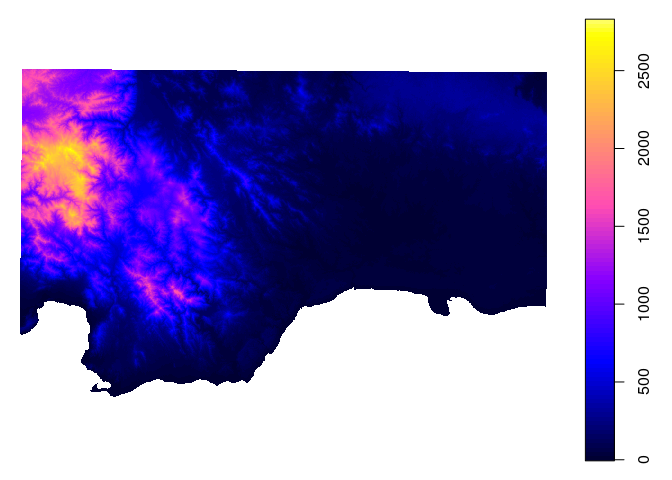
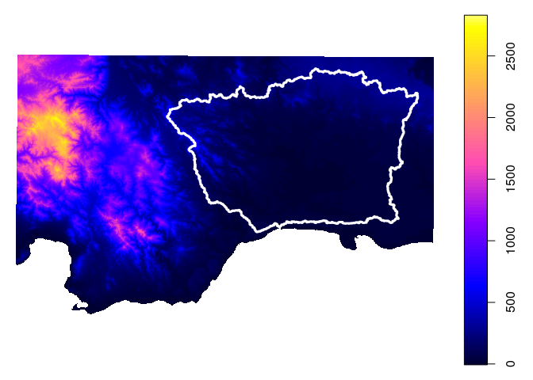
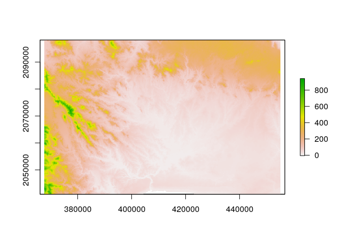
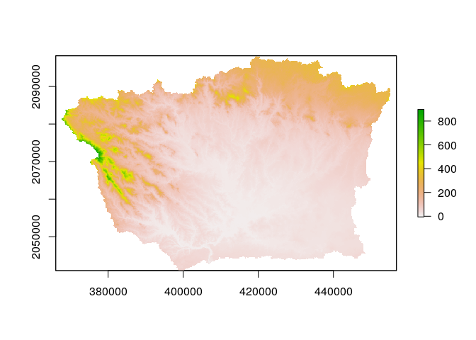
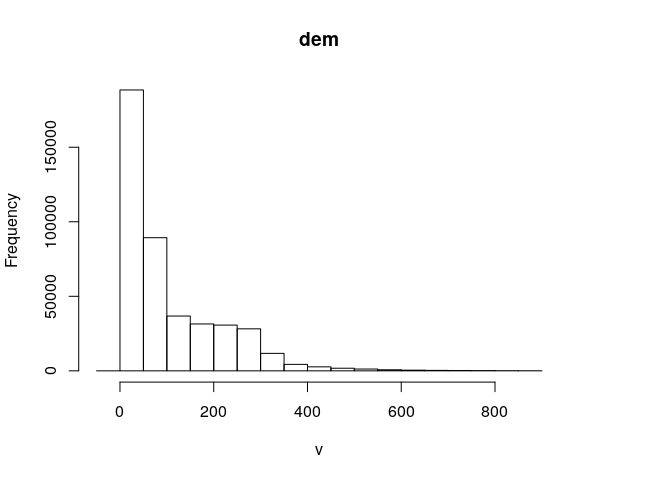
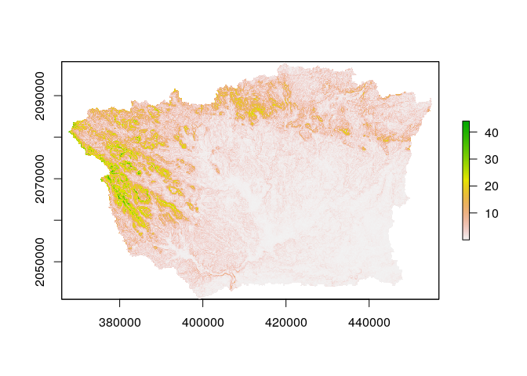
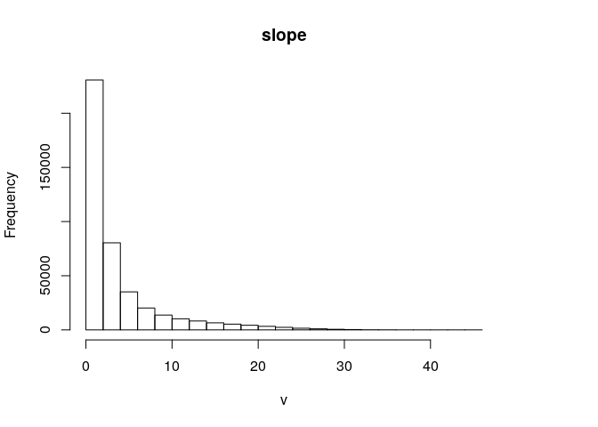

Calcular parámetros hidrográficos
================
Edel Tejada
21 de noviembre, 2020

``` r
## Proceso 0
library(rgrass7)
```

    ## Loading required package: XML

    ## GRASS GIS interface loaded with GRASS version: GRASS 7.8.2 (2019)
    ## and location: rdom

``` r
library(sf)
```

    ## Linking to GEOS 3.8.0, GDAL 3.0.4, PROJ 7.0.0

``` r
library(raster)
```

    ## Loading required package: sp

``` r
library(sp)

## Primera Ejecucion (Diretorio de la region)
gisdbase <- 'grass-data-test' #Base de datos de GRASS GIS
wd <- getwd() #Directorio de trabajo
wd
```

    ## [1] "/home/edelte/unidad-0-asignacion-99-mi-manuscrito-edeltejeda"

``` r
## Segundo (definir la localizacion)

loc <- initGRASS(gisBase = "/usr/lib/grass78/",
                 home = wd,
                 gisDbase = paste(wd, gisdbase, sep = '/'),
                 location = 'rdom',
                 mapset = "PERMANENT",
                 override = TRUE)

## Septimo (informacion)

execGRASS(
  'g.list',
  flags = 't',
  parameters = list(
    type = c('raster', 'vector')
  )
)
```

    ## raster/accum-de-rwshed
    ## raster/aspect
    ## raster/basins
    ## raster/dem
    ## raster/drainage-dir-de-rstr
    ## raster/drainage-dir-de-rwshed
    ## raster/half-basins
    ## raster/order-hack-gravelius
    ## raster/order-horton
    ## raster/order-shreve
    ## raster/order-strahler
    ## raster/order-topology
    ## raster/ozama-basin
    ## raster/ozama-stream-de-rstr
    ## raster/pcurv
    ## raster/r-stream-basins-1
    ## raster/r-stream-basins-2
    ## raster/r-stream-basins-3
    ## raster/r-stream-basins-4
    ## raster/r-stream-basins-5
    ## raster/r-stream-basins-6
    ## raster/r-stream-basins-7
    ## raster/slope
    ## raster/stream-de-rwshed
    ## raster/tcurv
    ## vector/c_ozama
    ## vector/dem_extent
    ## vector/order_all
    ## vector/ozama_basin
    ## vector/ozama_stream_de_rstr
    ## vector/r_stream_basins_1
    ## vector/r_stream_basins_2
    ## vector/r_stream_basins_3
    ## vector/r_stream_basins_4
    ## vector/r_stream_basins_5
    ## vector/r_stream_basins_6
    ## vector/r_stream_basins_7

``` r
## Octavo (Paquete SP para representar como un Raster de R)

use_sp()
dem_sp <- readRAST('dem')
```

    ## Creating BIL support files...
    ## Exporting raster as floating values (bytes=4)
    ##    0%   3%   6%   9%  12%  15%  18%  21%  24%  27%  30%  33%  36%  39%  42%  45%  48%  51%  54%  57%  60%  63%  66%  69%  72%  75%  78%  81%  84%  87%  90%  93%  96%  99% 100%

``` r
## Noveno (Guardar parametros gaficos y plotear dem)
op <- par()
plot(dem_sp)
```



``` r
######################################################

c_ozama <- readVECT('ozama_basin')
```

    ## Warning in execGRASS("v.out.ogr", flags = flags, input = vname, type = type, : The command:
    ## v.out.ogr --overwrite -e input=ozama_basin type=area layer=1 output=/home/edelte/unidad-0-asignacion-99-mi-manuscrito-edeltejeda/grass-data-test/rdom/PERMANENT/.tmp/rstudio-ubuntu-s-1vcpu-2gb-nyc3-01/284.0.gpkg output_layer=ozama_basin format=GPKG
    ## produced at least one warning during execution:
    ## Exporting 2 areas (may take some time)...
    ##   50% 100%
    ## WARNING: 1 feature without category was skipped. Features without category
    ##          are written only when -c flag is given.
    ## v.out.ogr complete. 1 feature (Polygon type) written to <ozama_basin> (GPKG
    ## format).

    ## Exporting 2 areas (may take some time)...
    ##   50% 100%
    ## WARNING: 1 feature without category was skipped. Features without category
    ##          are written only when -c flag is given.
    ## v.out.ogr complete. 1 feature (Polygon type) written to <ozama_basin> (GPKG
    ## format).
    ## OGR data source with driver: GPKG 
    ## Source: "/home/edelte/unidad-0-asignacion-99-mi-manuscrito-edeltejeda/grass-data-test/rdom/PERMANENT/.tmp/rstudio-ubuntu-s-1vcpu-2gb-nyc3-01/284.0.gpkg", layer: "ozama_basin"
    ## with 1 features
    ## It has 3 fields

``` r
plot (c_ozama)

###################   
plot(dem_sp)
```


``` r
plot(c_ozama, add=T, col='transparent', border='white', lwd=3);par(op[c('mfrow','mar')])
```



``` r
## Codigos de analis 

dem_r0 <- raster(dem_sp)
dem_r0
```

    ## class      : RasterLayer 
    ## dimensions : 1066, 1642, 1750372  (nrow, ncol, ncell)
    ## resolution : 89.1343, 89.1343  (x, y)
    ## extent     : 314490.3, 460848.8, 2008160, 2103177  (xmin, xmax, ymin, ymax)
    ## crs        : +proj=utm +no_defs +zone=19 +a=6378137 +rf=298.257223563 +towgs84=0.000,0.000,0.000 +to_meter=1 
    ## source     : memory
    ## names      : dem 
    ## values     : -6.732409, 2830.584  (min, max)

``` r
dem_r1 <- crop(dem_r0, c_ozama)
dem_r1
```

    ## class      : RasterLayer 
    ## dimensions : 642, 983, 631086  (nrow, ncol, ncell)
    ## resolution : 89.1343, 89.1343  (x, y)
    ## extent     : 367614.3, 455233.3, 2040961, 2098186  (xmin, xmax, ymin, ymax)
    ## crs        : +proj=utm +no_defs +zone=19 +a=6378137 +rf=298.257223563 +towgs84=0.000,0.000,0.000 +to_meter=1 
    ## source     : memory
    ## names      : dem 
    ## values     : -6.732409, 941.6263  (min, max)

``` r
plot(dem_r1)
```



``` r
dem_ozama <- mask(dem_r1, c_ozama)
plot(dem_ozama)
```



``` r
dem_ozama
```

    ## class      : RasterLayer 
    ## dimensions : 642, 983, 631086  (nrow, ncol, ncell)
    ## resolution : 89.1343, 89.1343  (x, y)
    ## extent     : 367614.3, 455233.3, 2040961, 2098186  (xmin, xmax, ymin, ymax)
    ## crs        : +proj=utm +no_defs +zone=19 +a=6378137 +rf=298.257223563 +towgs84=0.000,0.000,0.000 +to_meter=1 
    ## source     : memory
    ## names      : dem 
    ## values     : -6.732409, 897.3543  (min, max)

``` r
summary(dem_ozama)
```

    ##                   dem
    ## Min.        -6.732409
    ## 1st Qu.     30.932137
    ## Median      58.968285
    ## 3rd Qu.    161.659081
    ## Max.       897.354309
    ## NA's    202479.000000

``` r
mean(dem_ozama[],na.rm=T)
```

    ## [1] 106.3064

``` r
hist(dem_ozama)
```



``` r
pend_ozama <- terrain(x = dem_ozama, opt = 'slope', unit = 'degrees')
plot(pend_ozama)
```



``` r
pend_ozama
```

    ## class      : RasterLayer 
    ## dimensions : 642, 983, 631086  (nrow, ncol, ncell)
    ## resolution : 89.1343, 89.1343  (x, y)
    ## extent     : 367614.3, 455233.3, 2040961, 2098186  (xmin, xmax, ymin, ymax)
    ## crs        : +proj=utm +no_defs +zone=19 +a=6378137 +rf=298.257223563 +towgs84=0.000,0.000,0.000 +to_meter=1 
    ## source     : memory
    ## names      : slope 
    ## values     : 0.001692375, 44.07759  (min, max)

``` r
summary(pend_ozama)
```

    ##                slope
    ## Min.    1.692375e-03
    ## 1st Qu. 6.600855e-01
    ## Median  1.722326e+00
    ## 3rd Qu. 4.295218e+00
    ## Max.    4.407759e+01
    ## NA's    2.071450e+05

``` r
mean(pend_ozama[],na.rm=T)
```

    ## [1] 3.693682

``` r
hist(pend_ozama)
```


