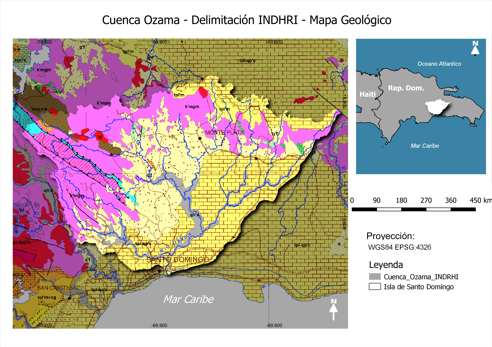
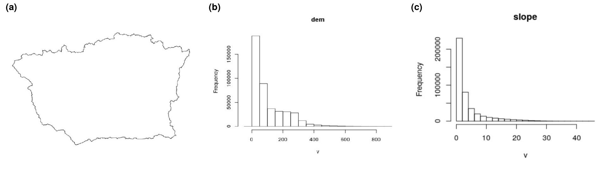

# Introducción

La geomorfología como topografía analítica, se fundamenta en la deducción de los antecedentes de la superficie terrestre y trata de predecir posibles cambios en el futuro en su configuracion [@pedraza1996geomorfologia]. Una de las ramas de la geomorfología con mayor desarrollo en las últimas décadas, es la geomorfología fluvial, que se encarga del estudio de los sistemas fluviales, especialmente la red y la cuenca. 

Una cuenca hidrográfica es una unidad morfológica que está delimitada de forma natural en donde sus aguas superficiales convergen hacia un lecho fluvial, y por medio de una red de cauces principales fluyen al mar [@gaspari2013elementos].

Los estudios morfométricos de cuencas y redes de drenaje, aportan conocimiento sobre el comportamiento morfodinámico e hidrológico, contribuyendo así al diseño informado de medidas de prevención en escenarios de abundantes precipitaciones, así como a la planificación del uso sustentable de la misma [@dominguez2003analisis]. Por otra parte @arriaga2009regiones resalta que el estudio de una cuenca es un avance para las políticas de administración sustentable, sobre todo en el contexto actual, donde no existen estudios que explique el comportamiento hídrico y morfométrico que permitan determinar y predecir su dinámica.

La cuenca del río Ozama, situada al sur-centro del República Dominicana, es idónea para distintos estudios, dado que es una cuenca modelo por múltiples razones: 1) Es una de las principales en términos ecológicos, porque existen en ella tres zonas de vida y dos zonas de transición en donde interactúan diferentes tipos de flora y fauna; 2) Se han declarado varias áreas protegidas dentro de la cuenca; 3) Una parte importante de su superficie incluye terrenos destinados para uso urbano, pero con preencia también destacada de la agricultura y la ganadería [@medioambiente]; 4) No dispone de estudios publicados sobre su morfometría. Si bien se trata de una cuenca importante para el país y para el entorno urbano, su escasa instrumentación impone retos añadidos al conocimiento de sus procesos específicos. Sin embargo, con las técnicas y la información de elevación disponibles actualmente, es posible profundizar en el conocimiento de esta cuenca mediante estudios morfométricos aplicados a geomorfología fluvial utilizando herramientas de bajo costo.

En la Republica Dominicana, los estudios de geomorfología fluvial son escasos y dispersos. La cuenca del río Ozama no escapa a esta realidad, y sólo cuenca con estudios generales y, aunque existe información geológica, no existen análisis morfométricos de la misma. Este trabajo aporta nuevo conocimiento sobre la red de drenaje del Ozama (e.g. orden de red, análisis hortoniano, análisis de cursos más largos para determinar perfiles longitudinales e índices de concavidad), e igualmente estudia la delimitación de la cuenca y subcuencas a partir de algoritmos de dirección. En todo el flujo de trabajo, se empleó software de código abierto (*open source*), y se generaron productos mediante *script* reproducible, lo que permitirá replicar este estudio sin ningún costo.

La exploración visual de las fuentes cartográficas existentes previas a la realización del presente estudio, reveló patrones de la cuenca que ameritan interpretación. Concretamente, la cuenca tiene una forma peculiar (e.g. de perímetro muy rectilíneo desdibujando patrón geométrico regular), y su red de drenaje presenta unas características bastante llamativas (e.g. cursos de largo desarrollo, perfiles de elevación muy variables).

En este sentido, interesa conocer cuáles son los controles que explican su morfología, por qué determinados sectores de la misma presentan evidencia preliminar de procesos de reorganización del drenaje y, en su caso, formular una o varias hipótesis que expliquen estos fenómenos. Comúnmente, la morfometría de cuenca deja señales inequívocas (e.g. hipsometría) con las cuales interpretar posibles controles litológicos y estructurales. 

Igualmente, por medio de exploración visual, se clasifican las distintas formas de la red Ozama, utilizando tipologías ampliamente reconocidas en estudios morfométricos @pedraza1996geomorfologia, y se interpretan posibles factores explicativos en cada caso.   
Según Horton (1945), comúnmente la razón de bifurcación es constante para todos los órdenes de red de una cuenca. En el presenta estudio, se calcula la razón de bifurcación con el objetivo de determinar si este fenómeno ocurre en la cuenca del río Ozama. 

La configuración espacial resultado de los análisis aplicados a los perfiles longitudinales y los índices de concavidad de los cursos más largos de una cuenca, muy a menudo arrojan que se relacionan con la litología, por lo que, el análisis aplicado a la cuenca Ozama persigue comprobar si su curso más largo se rige bajo este criterio y si existe alguna evidencia en la cuenca Ozama de uno o varios fenómenos de reorganización del drenaje. 

# Metodología

Se recopilaron datos de elevación, conocimiento de terreno y productos cartográficos, todos referidos a la cuenca del río Ozama y su entorno. Dichas fuentes fueron procesadas con algoritmos de morfometría fluvial dentro de un ambiente de programación estadística, para obtener las principales tendencias. 

## Área de Estudio

La cuenca del río Ozama abarca una superficie de 2,847.15 kilometros cuadrados, se encuentra ubicada entre las coordendas geográficas de 18º58'30.393" N y 18º23'40.846" N latitud norte y 70º16'5.369" W y 69º24'27.891" W longitud oeste [@medioambiente]. Por su tamaño, es la cuarta cuenca mas grande de la República Dominicana, y en cuanto a longitud de curso más largo es la tercera [@williamgutierrez2014]. Según @medioambiente, el río nace en la Loma Palo Bonito (loma Siete Cabezas), la cual forma parte de la sierra de Yamasa (Ver figura \ref{fig:ubi-indrhi}).


{width=75%}


Cubre el área geomórfica de la Llanura Costera del Caribe, incluyendo áreas de roca de tipo caliza de arrecifes costeros y depósitos aluviales y de origen lacustre marino, con una superficie de 1,719.65\,km\textsuperscript{2} (61.60%). La zona montañosa comprende la cordillera oriental, la región de la Sierra de Yamasá y la llanura montañosa de Los Haitises, con una superficie de 1,072.40\,km\textsuperscript{2} (38.40 %). El tipo geológico está compuesto por materiales sedimentarios, diversos arrecifes, grava, conglomerado (tipo Santo Domingo en La Romana), calizas grises tipo Hatillo, sedimentos aluviales de lagos oceánicos en cauces fluviales, terrazas planicies aluviales y valles [@medioambiente], (Ver figura \ref{fig:geo_}).

{width=75%}

## Fuentes de datos y métodos

Los parámetros morfométricos se calcularon abarcando aspectos de los atributos de la red y de la cuenca. Los cálculos se efectuaron en GRASS GIS desde R, usando el paquete rgrass7 (Bivand, 2019), siguiendo el flujo de trabajo de semiprocesamiento automático  propuesto por @joseramonmartinezbatlle2020.

Se utilizó un modelo digital de elevación (DEM) espacial existente (SRTM3 v2.1 y AW3D-30m v1), mejorado con el algoritmo *Multi-Error Removed Improved Terrain (MERIT)*, el cual elimina y corrige los errores de  orientación absoluta, ruido de rayas, ruido de moteado y orientación de altura de árbol [@daiyamazaki2018]. Este MERIT DEM fue descargado del sitio web de Dai YAMAZAKI's (http://hydro.iis.u-tokyo.ac.jp/~yamadai). 

El DEM, proyectado en UTM (EPSG:32619), fue introducido al flujo de trabajo en GRASS GIS. Las propiedades de la región de trabajo se hicieron coincidir con aquellas del DEM (e.g. resolución, extensión).  A continuación, se calcularon parámetros hidrográficos básicos (e.g. acumulación y dirección de flujo), con la función `r.watershed` [@ehlschlaeger1989using], utilizando un umbral de acumulación de flujo de 80 celdas y sin utilizar rellenado de depresiones (fill sink).Obtenido el mapa de dirección de flujo y la coordenada de la desembocadura del curso principal de la cuenca, se generó la cuenca de drenaje con el addon de GRASS GIS `r.water.outlet` [@ehlschlaeger1989using],  adicional a esto con `r.stream.extract` [@holmgren1994multiple], se extrajo otra red de drenaje a partir de un DEM enmascarado, es decir se extrajo de un área previamente delimitada por el @institutonacionalderecursoshidraulicos. 

Para obtener los cursos más largos de la cuenca Ozama y los cursos más largo de sus cuencas tributarias así como sus perfiles longitudinales, sus índices de concavidad y sus curvas hipsométricas se requirieron la creación de varios mapas y estadísticas con la ejecución una serie de scripts: 1) mapa de dirección de flujo (`r.stream*`), [@jasiewicz2011new]; 2) mapa de orden red (`r.stream.order`),[@drwal1982wyksztalcenie]; 3) un mapa de cuencas según órdenes de red (`r.stream.basins`), [@jasiewicz2011new],  por los métodos de Strahler y Horton; 4) estadística resumidas por órdenes de red y la razón de bifurcación (`r.stream.stats`), [@horton1945erosional], [@GRASS_GIS_software].   


# Resultados

Se presentan los parámetros morfométricos y topográficos de la cuenca del río Ozama. A continuación, se resumen las principales características morfométricas de la red hidrográfica, a partir del análisis de su orden de red y su razón de bifurcación. Posteriormente, los perfiles longitudinales e índices de concavidad son analizados en seis partes para su mejor compresión. Finalmente son detallados  los parámetros morfométricos y el curso más largo de la cuenca Ozama obtenidos con el addon  `r.basin*`.

## Delimitación y Forma

La cuenca extraída en este estudio alcanzó ca. 3,400\,km\textsuperscript{2} y un perímetro de 420\,km. Estas cifras contrastan con las calculadas a partir del polígono de delimitación del INDRHI, cuyos valores de área y perímetro fueron de 2,740\,km\textsuperscript{2} y 300\,km, respectivamente. En cuanto a forma, la cuenca extraída en este estudio se extiende hacia el este sobrepasando, por mucho, los límites de la cuenca del INDRHI (Ver figura \ref{fig:3_n_1}). La delimitación de la cuenca Ozama, al observarla, podemos decir que forma una figura trapezoidal.


## Datos de Elevación y Pendiente

La cuenca del río Ozama alcanza como elevación maxima aprox. 900 metros sobre el nivel del mar, con promedio de 110 metros, mediana en 60 metros y un valor minimo de 0 metros con fuerte sesgo a la derecha (Ver figura \ref{fig:3_n_1}). Esto implica que la mayor parte de las elevaciones de la cuenca del río Ozama son bajas.

La pendiente máxima de la cuenca del río Ozama es de aproximadamente 45 grados, la pendiente promedio es de 37 grados, la mediana es de 20 grados y la mínima es de 0 grados (Ver figura \ref{fig:3_n_1}). La cuenca ozama cuenca con pendientes que desde el punto de vista agropecuario se corresponden a los mejores suelos para su aprovechamiento mientras que los procesos erosivos y los movimientos de masas son menores.


{width=100%}

## Red de dranaje, orden de red y análisis hortoniano

Partiendo de su cauce principal se generó la red de drenaje de la cuenca del rio Ozama, la cual tiene un orden de red mínimo de 1 y un máximo de 7, según el método de Horton aplicado para determinar su grado de ramificación [@horton1945erosional] (Ver figura \ref{fig:C_O}).

{width=75%}


La cuenca del rio Ozama tiene 1,328 cursos fluviales de orden 1, 274 de orden 2, 63 de orden 3, 13 de orden 4, 5 de orden 5, 2 de orden 6 y 1 de orden 7. La razón de bifurcación para el par de órdenes 1-2 es 1,328/274=4.846, para el par 2-3 es 274/63=4.349, para el par 3-4 es 63/13=4.846, para el par 4-5 es 13/5=2.600, para el par 5-6 es 5/2=2.500, para el par 6-7 es 2/1=1. El valor promedio sería Rb=3.523679 (Ver Tabla \ref{tab:tabla}). La razón de bifurcación obtenida por medio de la pendiente de la recta fue de Rb=3.361632 (Ver figura \ref{fig:Rb_R}).  
                                   

| Orden | No. de Cursos |
|:-----:|:-------------:|
|   1   |     1,328     |
|   2   |      274      |
|   3   |       63      |
|   4   |       13      |
|   5   |       5       |
|   6   |       2       |
|   7   |       1       |

Table: Órdenes de red con sus repectivos cursos fluviales\label{tab:tabla}

\newpage

{width=75%}

## Perfiles Longitudinales e Índices de Concavidad 

La complejidad de la Cuenca Ozama obligo a que este análisis se dividiera en seis partes, estas se corresponden a subcuencas que se definieron para abarcar todos los perfiles longitudinales con sus valores de concavidad. 

Los perfiles longitudinales de los cursos fluviales que drenan la subcuenca principal Rio Ozama, presentan características similares, tales como en el rango de valores de concavidad.  Un detallado análisis permite observar 5 grupos de tendencias, en donde el grupo uno (1) presenta errores en desembocadura y cabecera que pudieran ser ocasionados por DEM, el grupo dos (2) muestra meseta en cabecera, provocando índices de concavidad negativos (convexos), el tercer grupo (3) es formado por los que tienen concavidad perfecta, el cuarto (4) grupo se caracteriza por cambios que pudieran ocurrir en la litología, formando los llamados sifones, por último se observan perfiles con índices de concavidad cercanos a cero, estos forman el grupo número cinco (5) y abarcan los perfiles rectilíneos (Ver figura \ref{fig:LFP_Ozama0}, \ref{fig:LFP_Ozama1} y \ref{fig:LFP_Ozama2}). Los perfiles longitudinales cóncavos son muy pronunciados y los más frecuentes  en la subcuenca principal Rio Ozama.

El analisis de la subcuenca Rio Yacao al igual que en la subcuenca principal del Rio Ozama, los patrones de perfiles rectilíneos, concavidad perfecta, perfiles convexos y los perfiles de sifones están presentes, predominado de entre ellos los perfiles cóncavos.(Ver figura \ref{fig:LFP_yabacao0}, \ref{fig:LFP_yabacao1} y \ref{fig:LFP_yabacao2}). 

Los perfiles LFP que drenan el Arroyo Ocoa muestran un patrón rectilíneo predominante. Presentan claramente  tres patrones, uno formado por perfiles convexos con meseta en cabecera, perfiles rectilíneos y una gran cantidad de sifones.(Ver figura \ref{fig:LFP_ocoa0}, \ref{fig:LFP_ocoa1} y \ref{fig:LFP_ocoa2}).

Con altura máxima de aproximadamente 500 metros, la subcuenca Rio La Savita, posee perfiles longitudinales cóncavos predominantes, así como perfiles de concavidad perfecta y en cantidades muy mínimas presenta sifones y mesetas en cabeceras. (Ver figura \ref{fig:LFP_Savita0}, \ref{fig:LFP_Savita1} y \ref{fig:LFP_Savita2}). 

Los perfiles longitudinales que drenan el Arroyo Yuca presentan dos grupos de patrones, el cóncavo y el rectilíneo. Destacándose más los perfiles cóncavos.(Ver figura \ref{fig:LFP_Yuca0}, \ref{fig:LFP_Yuca1} y \ref{fig:LFP_Yuca2}).

Los perfiles cóncavos están muy presentes en la sucuenca del Rio Isabela, evidencia de esto, es la presencia de una gran cantidad de perfiles cóncavos perfectos, sim embargo también presentan un grupo de valores de índices de concavidad negativos dando origen a mesetas en cabeceras poco pronunciadas.(Ver figura \ref{fig:LFP_Isabela0}, \ref{fig:LFP_Isabela1} y \ref{fig:LFP_Isabela2}).

{width=65%}

{width=100%}

{width=100%}

{width=65%}

{width=100%}

{width=75%}

{width=60%}

{width=85%}

{width=75%}

{width=65%}

{width=75%}

{width=75%}

{width=65%}

{width=75%}

{width=75%}

{width=65%}

{width=75%}

{width=75%}


\newpage
## Parámetros de la cuenca Ozama con `r.basin*`
El scrit (`r.basin*`) genero múltiples parámetros de la cuenca Ozama que mostraremos de manera resumida (Ver Tabla \ref{tab:tabla2}).

|Parámetros de la cuenca Ozama|Valores|
|:-----:|:-------------:|
|Centroide UTM|413955, 2069865|
|Área de la cuenca Ozama (\ km\textsuperscript{2})|3,400|
|Perímetro (km)|360|
|Elevación máxima (m)|900|
|Elevación mínima (m)|0|
|Elevación media (m)|110|
|Pendiente media (m)|4|
|Max order (Strahler)|7|
|No. de curso fluviales|1,615|
|Frecuencia de curso fluvial de primer orden|0.321559552|
|Razón Bifurcación  (Horton)|3.3679|
|Razón de longitud (Horton)|1.6319|
|Razón área (Horton)|3.6528|
|Razón pendiente (Horton)|1.3764|

Table: Parámetros de la cuenca Ozama generados con `r.basin*`\label{tab:tabla2}


Loma Rancho de Yagua-Loma Palo Bonito, allí nace el Ozama, o al menos allí se enraíza su curso más largo, desembocando en el Mar Caribe (Ver figura \ref{fig:c_m_l}).

{width=75%}

\newpage

# Discusión

A partir de los hallazgos encontrados, todos los objetivos planteados en este artículo fueron logrados. Al observar de manera visual la morfometría de la cuenca Ozama, presenta evidencias de procesos de reorganización del drenaje, determinamos que existen dos posibles codos de captura, a) Uno ubicada al este de Piedra y al norte de Esperalvillo, existiendo probabilidad de que el curso fluvial más largo del Ozama drenara sus aguas hacia los Haitises; b) el segundo es el En curso fluvial que sale de Sabana Grande de Boya hacia el Rio Ozama, pudiendo este en el pasado drenar sus aguas en el Rio Camú, o en algún otro rio del noreste de la Isla de Santo Domingo. 

Al superponer la Cuenca Ozama generada con el Mapa Geológico Nacional, en las zonas donde están estos posibles codos de capturas, predominan las rocas clásticas y las rocas calizas, por lo que, se planeta la posible existencia de piratería kárstica en estas zonas. 

Esta hipótesis se relaciona con lo planteado por @batlle2019drainage, quien señala que la piratería kárstica es un motor potencial del reordenamiento del drenaje, y que ocurre en zonas de afloramiento de piedras calizas. De igual manera también se relaciona con lo establecido por @gutierrez2008geomorfologia , quien explica que si la roca se erosiona fácilmente, como marga o arcilla, se produce una rápida erosión que puede provocar la división de un río, para finalmente producir una captura por otro rio.

La caracterización morfológica de la red de drenaje de la Cuenca Ozama, presenta cuatro patrones de redes de drenaje bien definidos (Paralela, Rectangular, Dendrítica, Enrejada), esto según @gutierrez2008geomorfologia es debido a la interacción fluvial con los materiales erosionables, argumento que pudimos comprobar, al observar (en el mapa Geológico Nacional) que la cuenca drena sus aguas a través de una diversidad de rocas.

Si el clima y la litología permanecen sin cambios, la razón de bifurcación (Rb) explicada  por el resultado de la relación entre el número de cauces de cualquier orden y el número de cauces en el orden inferior, dicho resultado siempre será constante entre un orden y otro [@horton1945erosional]. Las razones de bifurcación calculada para los pares de órdenes de red 4-5, y 5-6, de la Cuenca Ozama no se ajustan al criterio planteado por Horton, debido a que estas varían con valores que van desde 1 a 2. La guía elaborada por @jose_ramon_martinez_batlle_2021_4425878 explica que la razón de bifurcación calculada por los métodos  de coeficientes de regresión y por el promedio de las razones de bifurcación de cada par de órdenes de red, difieren en sus resultados, esto fue comprobado para la razón de bifurcación calculada a la Cuenca Ozama por ambos métodos, sin embargo el error resultante es un valor muy pequeño.

Para concluir, este trabajo de investigación se ha interesado principalmente en conocer aspectos generales de la morfometría fluvial de la cuenca Ozama, sin embargo, los hallazgos que se han presentado, requieren que se inicien nuevas investigaciones para profundizar en temas en específicos como por ejemplo a lo relacionado con su reordenamiento del drenaje. Investigaciones que en la Republica Dominicana son escasas o no existen, como ya se había mencionado anteriormente. 


# *Script* reproducible

## Paquetes

```{r,eval=FALSE}
library(rgrass7)
```

## Región de GRASS

```{r,eval=FALSE}
gisdbase <- 'grass-data-test' #Base de datos de GRASS GIS
wd <- getwd() #Directorio de trabajo
wd
loc <- initGRASS(gisBase = "/usr/lib/grass78/",
                 home = wd,
                 gisDbase = paste(wd, gisdbase, sep = '/'),
                 location = 'rdom',
                 mapset = "PERMANENT",
                 override = TRUE)
```


```{r,eval=FALSE}
knitr::opts_chunk$set(
  echo = TRUE,
  collapse=TRUE,
  eval = T
)
```


```{r,eval=FALSE}
source(
  knitr::purl(
    'intro-rgrass.Rmd',
    output=tempfile()
  )
)
```

## Proceso 0
```{r,eval=FALSE}
#Quité el paquete rgrass7, porque ya se carga al ejecutar el script intro-rgrass.Rmd
library(sf)
library(raster)
library(sp)
```


## Definir proyección basado en una fuente externa, en este caso, el DEM MERIT


```{r,eval=FALSE}
gmeta()
dem <- 'data/dem.tif'
#Definir la proyección de la región basada en DEM
execGRASS(
  cmd = 'g.proj',
  flags = c('t','c'),
  georef=dem)
gmeta()
```

## Importar mapa raster

```{r,eval=FALSE}
execGRASS(
  cmd = 'r.in.gdal',
  flags=c('overwrite','quiet'),
  parameters=list(
    input=dem,
    output='dem'
  )
)
```

## Actualizar la extensión de la región al DEM, sólo por precaución

```{r,eval=FALSE}
execGRASS(
  cmd = 'g.region',
  parameters=list(
    raster = 'dem',
    align = 'dem'
  )
)
```

## Mostrar la definición de la región

```{r,eval=FALSE}
gmeta()
```

## Para completar, importar un mapa vectorial también

```{r,eval=FALSE}
demext <- 'data/dem-extension.geojson'
execGRASS(
  cmd = 'v.in.ogr',
  flags=c('overwrite','quiet'),
  parameters=list(
    input=demext,
    output='dem_extent'
  )
)

execGRASS(
  'g.list',
  flags = 't',
  parameters = list(
    type = c('raster', 'vector')
  )
)

source('borrar_mascara_si_la_hubiere.R')
unlink_.gislock()
```

---
output: html_document
editor_options: 
  chunk_output_type: console
---
##title: "Calcular parámetros hidrográficos con r.watershed. Visualizar con leaflet"

```{r,eval=FALSE}
knitr::opts_chunk$set(
  echo = TRUE,
  collapse=TRUE,
  eval = T
)
options(knitr.duplicate.label = "allow")
```


## ejecutar Scrit anteriores

```{r,eval=FALSE}
source(
  knitr::purl(
    'proyeccion-importar-fuente-extension_C_Propia.Rmd',
    output=tempfile()
  )
)
knitr::opts_chunk$set(fig.path = "img/calcwshed/")
```

## `g.list`

```{r,eval=FALSE}
execGRASS(
  'g.list',
  flags = 't',
  parameters = list(
    type = c('raster', 'vector')
  )
)
```

## Calcular parámetros hidrográficos de interés usando `r.watershed`

```{r,eval=FALSE}
execGRASS(
  "r.watershed",
  flags = c('overwrite','quiet'),
  parameters = list(
    elevation = "dem",
    accumulation = "accum-de-rwshed",
    stream = "stream-de-rwshed",
    drainage = "drainage-dir-de-rwshed",
    basin = 'basins',
    half_basin = 'half-basins',
    threshold = 80
  )
)
```


## Traer capas a R

```{r,eval=FALSE}
# Usar Spatial 
library(sp)
use_sp()
#Paquete manejo de los raster
library(raster)
#DEM
dem <- raster(readRAST('dem'))
#Basins
basins <- raster(readRAST('basins'))
#Stream network
stream <- raster(readRAST('stream-de-rwshed'))
stream3857 <- projectRaster(stream, crs = CRS("+init=epsg:3857"), method = 'ngb')
#Generar un vectorial de extensión de capa en EPSG:4326
e <- extent(stream)
e <- as(e, 'SpatialPolygons')
proj4string(e) <- CRS("+init=epsg:32619")
e <- spTransform(e, CRSobj = CRS("+init=epsg:4326"))
```


## Visualizar capas con `leaflet`

```{r,eval=FALSE}
library(leaflet)
library(leafem)
r_wshed_salida <- leaflet() %>%
  addProviderTiles(providers$Stamen.Terrain, group = 'terrain') %>%
  addRasterImage(dem, group='DEM', opacity = 0.5) %>%
  addRasterImage(
    ratify(basins),
    group='basins', opacity = 0.7,
    colors = sample(rep(RColorBrewer::brewer.pal(12, 'Set3'),1000))) %>% 
  addRasterImage(stream3857, project = F, group='str', opacity = 0.7, method = 'ngb', colors = 'blue') %>% 
  addLayersControl(
    overlayGroups = c('terrain','DEM','basins','str'),
    options = layersControlOptions(collapsed=FALSE)) %>% 
  addHomeButton(extent(e), 'Ver todo')
r_wshed_salida
#La siguiente línea toma una captura de este mapa (toma tiempo, paciencia)
r_wshed_salida %>% mapview::mapshot(file = 'r_wshed_salida.png')
```

## Limpiar archivo de bloqueo del conjunto de mapas de GRASS. Quitar máscara, si la hubiere

```{r,eval=FALSE}
source('borrar_mascara_si_la_hubiere.R')
unlink_.gislock()
```

---
output: html_document
editor_options: 
  chunk_output_type: console
---

## Extraer una cuenca de drenaje con r.water.outlet. Visualizar con mapview y leaflet

```{r,eval=FALSE}
knitr::opts_chunk$set(
  echo = TRUE,
  collapse=TRUE,
  eval = T
)
options(knitr.duplicate.label = "allow")

```

```{r,eval=FALSE}
source(
  knitr::purl(
    'Calcular parámetros hidrográficos con r watershed Visualizar con leaflet cuen propia.Rmd',
    output=tempfile()
  )
)
knitr::opts_chunk$set(fig.path = "img/basinoutlet/")
```

## Obtener las coordenadas de la desembocadura de la cuenca de interés

```{r,eval=FALSE}
library(mapview)
red_de_r_watershed <- mapview(
  stream3857, method='ngb', col.regions = 'blue',
  legend = FALSE, label = FALSE, maxpixels =  1801674
)#Los cursos fluviales no aparecen continuos, porque no imprime los rásters completamente
red_de_r_watershed
red_de_r_watershed %>% mapview::mapshot(file = 'red_de_r_wshed_salida.png')
```

## Convertir las coordenadas lat/lon a EPSG:32619

```{r,eval=FALSE}
my_trans <- function(coords = NULL) {
  require(sp)
  pt <- SpatialPoints(matrix(coords, ncol = 2), CRS("+init=epsg:4326"))
  foo <- spTransform(pt, CRSobj = CRS("+init=epsg:32619"))
  bar <- as.vector(coordinates(foo))
  return(bar)
}
ozama_out <- my_trans(coords = c(-69.88087,18.47427))
ozama_out
```

## Extraer la cuenca de interés

```{r,eval=FALSE}
execGRASS(
  "r.water.outlet",
  flags = c('overwrite','quiet'),
  parameters = list(
    input = 'drainage-dir-de-rwshed',
    output = 'ozama-basin',
    coordinates = ozama_out
  )
)
```

## Convertir la cuenca a vectorial en GRASS

```{r,eval=FALSE}
execGRASS(
  "r.to.vect",
  flags = c('overwrite','quiet'),
  parameters = list(
    input = 'ozama-basin',
    output = 'ozama_basin',
    type = 'area'
  )
)
```

## Traer a R la cuenca del Cuenca Ozama

```{r,eval=FALSE}
ozama_bas <- readVECT('ozama_basin')
ozama_bas
plot(ozama_bas)
ozama_bas4326 <- spTransform(ozama_bas, CRSobj = CRS("+init=epsg:4326"))
ozama_bas4326_leaf <- leaflet() %>% 
  addProviderTiles(providers$Stamen.Terrain) %>%
  addRasterImage(stream, opacity = 0.7, method = 'ngb', colors = 'blue') %>% 
  addPolygons(data = ozama_bas4326) %>% 
  leafem::addHomeButton(extent(ozama_bas4326), 'Ver cuenca')
ozama_bas4326_leaf
ozama_bas4326_leaf %>% mapview::mapshot(file = 'ozama_bas4326_salida.png')
```

## Limpiar archivo de bloqueo del conjunto de mapas de GRASS. Quitar máscara, si la hubiere

```{r,eval=FALSE}
source('borrar_mascara_si_la_hubiere.R')
unlink_.gislock()
```

---
output: html_document
editor_options: 
  chunk_output_type: console
---
## "Extraer una red drenaje con r.stream.extract. Visualizar con leaflet"

```{r,eval=FALSE}
knitr::opts_chunk$set(
  echo = TRUE,
  collapse=TRUE,
  eval = T
)
options(knitr.duplicate.label = "allow")
```

```{r,eval=FALSE}
source(
  knitr::purl(
    'crear-una-cuenca-con-r-water-outlet.Rmd',
    output=tempfile()
  )
)
knitr::opts_chunk$set(fig.path = "img/extractnet/")
```

## Mostrar lista nuevamente

```{r,eval=FALSE}
execGRASS(
  'g.list',
  flags = 't',
  parameters = list(
    type = c('raster', 'vector')
  )
)
```
## Usar la cuenca del Ozama como máscara
```{r,eval=FALSE}
execGRASS(
  "r.mask",
  flags = c('verbose','overwrite','quiet'),
  parameters = list(
    vector = 'ozama_basin'
  )
)
```

## Extraer la red de drenaje de la cuenca de interés
```{r,eval=FALSE}
execGRASS(
  "r.stream.extract",
  flags = c('overwrite','quiet'),
  parameters = list(
    elevation = 'dem',
    threshold = 80,
    stream_raster = 'ozama-stream-de-rstr',
    stream_vector = 'ozama_stream_de_rstr'
  )
)
```
## Traer a R la red de drenaje de la Cuenca Ozama

```{r,eval=FALSE}
ozama_net <- readVECT('ozama_stream_de_rstr', ignore.stderr = T)
ozama_net
plot(ozama_net)
ozama_net4326 <- spTransform(ozama_net, CRSobj = CRS("+init=epsg:4326"))
ozama_net4326
ozama_centroid <- coordinates(rgeos::gCentroid(ozama_bas4326))
ozama_centroid
ozama_net_r <- raster(readRAST('ozama-stream-de-rstr'))
ozama_net_r
ozama_net_r3857 <- projectRaster(ozama_net_r, crs = CRS("+init=epsg:3857"), method = 'ngb')
ozama_net_r3857
red_de_r_stream <- leaflet() %>% 
  setView(lng = ozama_centroid[1], lat = ozama_centroid[2], zoom = 10) %>%
  addProviderTiles(providers$Stamen.Terrain, group = 'terrain') %>%
  addRasterImage(ozama_net_r3857, opacity = 0.7, method = 'ngb', colors = 'grey20', group = 'str_raster') %>% 
  addPolylines(data = ozama_net4326, weight = 3, opacity = 0.7, group = 'str_vect') %>% 
  leafem::addHomeButton(extent(ozama_net4326), 'Ver todo') %>% 
  addLayersControl(
    overlayGroups = c('terrain','str_vect','str_raster'),
    options = layersControlOptions(collapsed=FALSE))
red_de_r_stream
red_de_r_stream %>% mapview::mapshot(file = 'red_de_r_stream_salida.png')
```

## Limpiar archivo de bloqueo del conjunto de mapas de GRASS

```{r,eval=FALSE}
unlink_.gislock()
```


---
output: html_document
editor_options: 
  chunk_output_type: console
---
## "Orden de red, morfometría y análisis hortoniano usando r.stream*"


```{r,eval=FALSE}
knitr::opts_chunk$set(
  echo = TRUE,
  collapse=TRUE,
  eval = T
)
options(knitr.duplicate.label = "allow")
```

## #########################

```{r,eval=FALSE}
source(
  knitr::purl(
    'extraer-red-de-drenaje-con-r-stream.Rmd',
    output=tempfile()
  )
)
knitr::opts_chunk$set(fig.path = "img/streamorder/")
```

## Imprimir lista de mapas ráster y vectoriales dentro en la región/localización activa

* Nótese que los paquetes requeridos en esta sessión (`rgrass7`, `raster`, `leaflet`, `leafem`), fueron en el bloque anterior al ejecutarse el código contenido en el archivo `extraer-red-de-drenaje-con-r-stream.Rmd`. Igualmente, dicho bloque de código creó todos los objetos necesarios para realizar este tutorial.

```{r,eval=FALSE}
execGRASS(
  'g.list',
  flags = 't',
  parameters = list(
    type = c('raster', 'vector')
  )
)
```

## Crear mapa de dirección de flujo a partir de r.stream

```{r,eval=FALSE}
execGRASS(
  "r.stream.extract",
  flags = c('overwrite','quiet'),
  parameters = list(
    elevation = 'dem',
    threshold = 80,
    direction = 'drainage-dir-de-rstr'
  )
)
```

## Crear mapas de órdenes de red

```{r,eval=FALSE}
execGRASS(
  "r.stream.order",
  flags = c('overwrite','quiet'),
  parameters = list(
    stream_rast = 'ozama-stream-de-rstr',
    direction = 'drainage-dir-de-rstr',
    elevation = 'dem',
    accumulation = 'accum-de-rwshed',
    stream_vect = 'order_all',
    strahler = 'order-strahler',
    horton = 'order-horton',
    shreve = 'order-shreve',
    hack = 'order-hack-gravelius',
    topo = 'order-topology'
  )
)
```

## Mostrar lista nuevamente

```{r,eval=FALSE}
execGRASS(
  'g.list',
  flags = 't',
  parameters = list(
    type = c('raster', 'vector')
  )
)
```

## Visualizar la red con leaflet

## Simbología única
```{r,eval=FALSE}
   {r, results='hide', warning=FALSE, message=FALSE}
order <- readVECT('order_all')
```

```{r,eval=FALSE}
order4326 <- spTransform(order, CRSobj = CRS("+init=epsg:4326"))
leaflet() %>% 
  addProviderTiles(providers$Stamen.Terrain, group = 'terrain') %>%
  addPolylines(
    data = order4326, weight = 3, opacity = 0.7, group = 'order',
    label = ~as.character(strahler),
    highlightOptions = highlightOptions(color = "white",
                                      weight = 5, bringToFront = F, opacity = 1),
    labelOptions = labelOptions(noHide = F,
                                style = list(
                                  "font-size" = "8px",
                                  "background" = "rgba(255, 255, 255, 0.5)",
                                  "background-clip" = "padding-box",
                                  "padding" = "1px"))) %>% 
  leafem::addHomeButton(extent(order4326), 'Ver todo') %>% 
  addLayersControl(
    overlayGroups = c('terrain','order'),
    options = layersControlOptions(collapsed=FALSE))
```

## Simbología aplicando grosor según orden de red

```{r,eval=FALSE}
orden_de_red <- leaflet() %>% 
  addProviderTiles(providers$Stamen.Terrain, group = 'terrain') %>%
  addPolylines(
    data = order4326, weight = order4326$strahler*1.5, opacity = 0.7, group = 'order',
    label = ~as.character(strahler),
    highlightOptions = highlightOptions(color = "white",
                                      weight = 5, bringToFront = F, opacity = 1),
    labelOptions = labelOptions(noHide = F)) %>% 
  leafem::addHomeButton(extent(order4326), 'Ver todo') %>% 
  addLayersControl(
    overlayGroups = c('terrain','order'),
    options = layersControlOptions(collapsed=FALSE))
orden_de_red
orden_de_red %>% mapview::mapshot(file = 'orden_de_red_salida.png')
```

## Delimitar cuencas según orden de red de Strahler

## Obtener órdenes de red mínimo y máximo

```{r,eval=FALSE}
#Estadísticas para obtener los valores mínimo y máximo del orden de red de Strahler
rinfo.ordstra <- execGRASS(
  'r.info',
  flags = 'r',
  parameters = list(
    map = 'order-strahler'
  )
)
#Órdenes de red mínimo y máximo
minmaxord <- as.numeric(
  stringr::str_extract_all(
    attributes(rinfo.ordstra)$resOut,
    "[0-9]+"
  )
)
minmaxord
```

## Delimitar cuencas, convertirlas de ráster a vectorial

```{r,eval=FALSE}
sapply(
  min(minmaxord):max(minmaxord),
  function(x){
    execGRASS(
      "r.stream.basins",
      flags = c('overwrite','c','quiet'),
      parameters = list(
        direction = 'drainage-dir-de-rstr',
        stream_rast = 'order-strahler',
        cats = as.character(x),
        basins = paste0('r-stream-basins-',x)
      )
    )
    execGRASS(
      "r.to.vect",
      flags=c('overwrite','quiet'),
      parameters = list(
         input = paste0('r-stream-basins-',x),
         output = paste0('r_stream_basins_',x),
         type = 'area'
      )
    )
  }
)
```

## Representar las cuencas con leaflet

```{r,eval=FALSE}
{r, results='hide', warning=FALSE, message=FALSE}
sapply(
  min(minmaxord):max(minmaxord),
  function(x){
    assign(
      paste0('orden', x),
      spTransform(readVECT(paste0('r_stream_basins_',x),driver = 'SQLite'), CRSobj = CRS("+init=epsg:4326")),
      envir = .GlobalEnv)
  }
)
```

```{r,eval=FALSE}
paleta <- RColorBrewer::brewer.pal(12, 'Set3')
cuencas_y_orden_de_red <- leaflet() %>% 
  addProviderTiles(providers$Stamen.Terrain, group = 'terrain') %>%
  addPolygons(data = orden7, stroke = T, weight = 2,
              color = ~paleta, fillOpacity = 0.4, group = 'O7') %>%
  addPolygons(data = orden6, stroke = T, weight = 2,
              color = ~paleta, fillOpacity = 0.4, group = 'O6') %>%
  addPolygons(data = orden5, stroke = T, weight = 2,
              color = ~paleta, fillOpacity = 0.4, group = 'O5') %>%
  addPolygons(data = orden4, stroke = T, weight = 2,
              color = ~paleta, fillOpacity = 0.4, group = 'O4') %>% 
  addPolygons(data = orden3, stroke = T, weight = 2,
              color = ~paleta, fillOpacity = 0.4, group = 'O3') %>%
  addPolygons(data = orden2, stroke = T, weight = 2,
              color = ~paleta, fillOpacity = 0.4, group = 'O2') %>%
  addPolygons(data = orden1, stroke = T, weight = 2,
              color = ~paleta, fillOpacity = 0.4, group = 'O1') %>%
  addPolylines(
    data = order4326, weight = order4326$strahler*1.5,
    opacity = 0.7, group = 'str_order') %>%
  leafem::addHomeButton(extent(order4326), 'Ver todo') %>% 
  addLayersControl(
    overlayGroups = c('terrain','O1','O2','O3','O4','05','06','07','str_order'),
    options = layersControlOptions(collapsed=FALSE))
cuencas_y_orden_de_red
cuencas_y_orden_de_red %>% mapview::mapshot(file = 'cuencas_y_orden_de_red_salida.png')
```

## Estadísticas de red resumidas por orden de red.


```{r,eval=FALSE}
execGRASS(
  "r.stream.stats",
  flags = c('overwrite','quiet','o'),
  parameters = list(
    stream_rast = 'order-strahler',
    direction = 'drainage-dir-de-rstr',
    elevation = 'dem',
    output = 'ozama_stats.txt'
  )
)
file.show('ozama_stats.txt')
d <- read.csv("ozama_stats.txt", skip=1, header=TRUE)
d
plot(num_of_streams~order, data=d, log="y")
mod <- lm(log10(num_of_streams)~order, data=d)
abline(mod)
text(2, 20, 'logN=2.064-0.544u')
rb <- 1/10^mod$coefficients[[2]]
rb
```

## Estadísticas de red ampliadas

```{r,eval=FALSE}
execGRASS(
  "r.stream.stats",
  flags = c('overwrite','quiet'),
  parameters = list(
    stream_rast = 'order-strahler',
    direction = 'drainage-dir-de-rstr',
    elevation = 'dem',
    output = 'ozama_stats_expanded.txt'
  )
)
file.show('ozama_stats_expanded.txt')
```

## Limpiar archivo de bloqueo del conjunto de mapas de GRASS
```{r,eval=FALSE}
rbp <- mean(d$num_of_streams[-length(d$num_of_streams)]/d$num_of_streams[-1])
rbp
```
```{r,eval=FALSE}
unlink_.gislock()
```

---
output: html_document
editor_options: 
  chunk_output_type: console
---
## Calcular índices de concavidad y perfiles longitudinales de cursos fluviales


```{r,eval=FALSE}
knitr::opts_chunk$set(
  echo = TRUE,
  collapse=TRUE,
  eval = T
)
options(knitr.duplicate.label = "allow")
```

```{r,eval=FALSE}
source(
  knitr::purl(
    'orden-de-red.Rmd',
    output=tempfile()
  )
)
knitr::opts_chunk$set(fig.path = "img/profilesconcav/")
```

## Imprimir lista de mapas ráster y vectoriales dentro en la región/localización activa


```{r,eval=FALSE}
execGRASS(
  'g.list',
  flags = 't',
  parameters = list(
    type = c('raster', 'vector')
  )
)
```

## Obtener coordenada

```{r,eval=FALSE}
mapview(order, col.regions = 'blue', legend = FALSE)
```

## Obtener cursos más largos (cargar función propia)
```{r,eval=FALSE}
   {r, results='hide', warning=FALSE, message=FALSE}
devtools::source_url('https://raw.githubusercontent.com/geofis/rgrass/master/lfp_network.R') #Cargada como función "LfpNetwork"
LfpNetwork(
  xycoords = my_trans(c(-69.88117, 18.47503)),
  suffix = 'ozm',
  stream_vect = 'order_all',
  direction = 'drainage-dir-de-rstr'
)
```

## Imprimir lista de mapas ráster y vectoriales

```{r,eval=FALSE}
execGRASS(
  'g.list',
  flags = 't',
  parameters = list(
    type = c('raster', 'vector')
  )
)
```

## Representar con leaflet
```{r,eval=FALSE}

   {r, results='hide', warning=FALSE, message=FALSE}
lfp <- readVECT('LfpNetwork_lfp_all_final_ozm')
```

```{r,eval=FALSE}
lfp4326 <- spTransform(lfp, CRSobj = CRS("+init=epsg:4326"))
lfp_con_id <- leaflet() %>%
  addProviderTiles(providers$Stamen.Terrain, group = 'terrain') %>%
  addPolylines(
    data = lfp4326, weight = 3, opacity = 0.7, group = 'order',
    label = ~as.character(cat),
    highlightOptions = highlightOptions(color = "white",
                                      weight = 5, bringToFront = F, opacity = 1),
    labelOptions = labelOptions(noHide = T,
                                style = list(
                                  "font-size" = "8px",
                                  "background" = "rgba(255, 255, 255, 0.5)",
                                  "background-clip" = "padding-box",
                                  "padding" = "1px"))) %>% 
  leafem::addHomeButton(extent(lfp4326), 'Ver todo') %>% 
  leafem::addMouseCoordinates() ## Esto es para agregar coordenadas
lfp_con_id
lfp_con_id %>% mapview::mapshot(file = 'lfp_con_id_salida.png')


```

## Exportar a KML
```{r,eval=FALSE}
   {r, results='hide', warning=FALSE, message=FALSE}
execGRASS(
  'v.out.ogr',
  flags = c('overwrite','quiet'),
  parameters = list(
    input = 'LfpNetwork_lfp_all_final_ozm',
    output = 'lfp_ozm_kml.kml',
    format = 'KML',
    dsco = 'NameField=cat'
  )
)
```

## Obtención de perfiles longitudinales e índices de concavidad

```{r,eval=FALSE}
   {r, results='hide', warning=FALSE, message=FALSE}
source('lfp_profiles_concavity.R') #Cargado como función "LfpProfilesConcavity"
ozama_conv_prof <- LfpProfilesConcavity(
  xycoords = my_trans(c(-69.88117, 18.47503)),
  network = 'LfpNetwork_lfp_all_final_ozm',
  prefix = 'Oz',
  dem = 'dem',
  direction = 'drainage-dir-de-rstr',
  crs = '+init=epsg:32619',
  smns = 0.5,
  nrow = 5)
```

## Mostrar resultados

```{r,eval=FALSE}
ozama_conv_prof$profiles
ozama_conv_prof$concavityindex
ozama_conv_prof$dimensionlessprofiles$layers[[2]]$aes_params$size <- 2
ozama_conv_prof$dimensionlessprofiles$theme$text$size <- 12
ozama_conv_prof$dimensionlessprofiles
```

## Tabla dx/dy, tanto en metros como adimensional. Útiles para construir perfiles por cuenca propia

```{r,eval=FALSE}
ozama_conv_prof$lengthzdata %>% tibble::as.tibble()
ozama_conv_prof$lengthzdatadmnls %>% tibble::as.tibble()
```


## Limpiar archivo de bloqueo del conjunto de mapas de GRASS

```{r,eval=FALSE}
unlink_.gislock()
```

---
output: html_document
editor_options: 
  chunk_output_type: console
---
## Parámetros de cuenca con r.basin
```{r,eval=FALSE}
knitr::opts_chunk$set(
  echo = TRUE,
  collapse=TRUE,
  fig.path = "img/rbasin/",
  eval = T
)
options(knitr.duplicate.label = "allow")
```

```{r,eval=FALSE}
library(rgrass7)
gisdbase <- 'grass-data-test' #Base de datos de GRASS GIS
wd <- getwd() #Directorio de trabajo
wd
loc <- initGRASS(gisBase = "/usr/lib/grass78/",
                 home = wd,
                 gisDbase = paste(wd, gisdbase, sep = '/'),
                 location = 'c_ozama',
                 mapset = "PERMANENT",
                 override = TRUE)
gmeta()
execGRASS(
  'g.list',
  flags = 't',
  parameters = list(
    type = c('raster', 'vector')
  )
)
```

## Convertir a números enteros la extensión y la resolución del DEM

```{r,eval=FALSE}
library(raster)
rutadem <- 'data/dem.tif'
rawextent <- extent(raster(rutadem))
rawextent
devtools::source_url('https://raw.githubusercontent.com/geofis/rgrass/master/integerextent.R')
devtools::source_url('https://raw.githubusercontent.com/geofis/rgrass/master/xyvector.R')
newextent <- intext(e = rawextent, r = 90, type = 'inner')
newextent
gdalUtils::gdalwarp(
  srcfile = 'data/dem.tif',
  dstfile = 'data/demint.tif',
  te = xyvector(newextent),
  tr = c(90,90),
  r = 'bilinear',
  overwrite = T
)
```

## Importar a sesión de GRASS

```{r,eval=FALSE} 
   {r, results='hide', warning=FALSE, message=FALSE}
rutademint <- 'data/demint.tif'
execGRASS(
  "g.proj",
  flags = c('t','c'),
  georef=rutademint)
gmeta()
execGRASS(
  "r.in.gdal",
  flags='overwrite',
  parameters=list(
    input=rutademint,
    output="demint"
  )
)
execGRASS(
  "g.region",
  parameters=list(
    raster = "demint",
    align = "demint"
  )
)
```

```{r,eval=FALSE}
gmeta()
execGRASS(
  'g.list',
  flags = 't',
  parameters = list(
    type = c('raster', 'vector')
  )
)
```

## Generar red de drenaje para obtener coordenada posteriormente

```{r,eval=FALSE}
execGRASS(
  "r.stream.extract",
  flags = c('overwrite','quiet'),
  parameters = list(
    elevation = 'demint',
    threshold = 80,
    stream_raster = 'stream-de-rstr',
    stream_vector = 'stream_de_rstr'
  )
)
execGRASS(
  'g.list',
  flags = 't',
  parameters = list(
    type = c('raster', 'vector')
  )
)
```

## Obtener coordenada
```{r,eval=FALSE}
   {r, results='hide', warning=FALSE, message=FALSE}
library(sp)
use_sp()
library(mapview)
netw <- spTransform(
  readVECT('stream_de_rstr'),
  CRSobj = CRS("+init=epsg:4326"))
```

```{r,eval=FALSE}
mapview(netw, col.regions = 'blue', legend = FALSE)
```

## Transformar coordenada a EPSG:32619 como número entero

```{r,eval=FALSE}
source('my-trans.R')
outlet <- as.integer(my_trans(c(-69.88117,18.47503)))
```

## Ejecutar `r.basin`

```{r,eval=FALSE} 
    {r, results='hide', warning=FALSE, message=FALSE}
pref <- 'rbasin_ozama'
execGRASS(
  "r.basin",
  flags = 'overwrite',
  parameters = list(
    map = 'demint',
    prefix = pref,
    coordinates = outlet,
    threshold = 80,
    dir = 'salidas-rbasin/ozama'
  )
)
```

```{r,eval=FALSE}
execGRASS(
  'g.list',
  flags = 't',
  parameters = list(
    type = c('raster', 'vector')
  )
)
```

> Si `r.basin` arrojara error (sólo en el caso de error, no en caso de advertencia), ejecutar este bloque para borrar las salidas anteriores y reejecutar el `r.basin`:
```{r, eval=FALSE}
execGRASS(
  "g.remove",
  flags = 'f',
  parameters = list(
    type = c('raster','vector'),
    pattern = paste0(pref, '*')
  )
)
```

## Cargar los vectoriales transformados a EPSG:4326 para visualizar en leaflet

```{r,eval=FALSE}
    {r, results='hide', warning=FALSE, message=FALSE}
rbnetw <- spTransform(
  readVECT('rbasin_ozama_demint_network'),
  CRSobj = CRS("+init=epsg:4326"))
rbnetw
rbmain <- spTransform(
  readVECT('rbasin_ozama_demint_mainchannel'),
  CRSobj = CRS("+init=epsg:4326"))
rbmain
rbbasin <- spTransform(
  readVECT('rbasin_ozama_demint_basin'),
  CRSobj = CRS("+init=epsg:4326"))
rbbasin
```

```{r,eval=FALSE}
library(leaflet)
leaflet() %>%
  addProviderTiles(providers$Stamen.Terrain, group = 'terrain') %>%
  addPolylines(data = rbnetw, weight = 3, opacity = 0.7) %>% 
  addPolylines(data = rbmain, weight = 3, opacity = 0.7, color = 'red') %>% 
  addPolygons(data = rbbasin) %>% 
  leafem::addHomeButton(extent(rbbasin), 'Ver cuenca')
```

## Explorar los parámetros de cuenca

```{r,eval=FALSE}
library(readr)
rbozamapar1 <- read_csv("salidas-rbasin/ozama/rbasin_ozama_demint_parametersT.csv")
rbozamapar1 %>% tibble::as_tibble()
rbozamapar2 <- read_csv(
  "salidas-rbasin/ozama/rbasin_ozama_demint_parameters.csv",
  skip=2, col_names = c('Parameter', 'Value'))
rbozamapar2 %>% print(n=Inf)
```

## Limpiar archivo de bloqueo del conjunto de mapas de GRASS

```{r,eval=FALSE}
unlink_.gislock()
```


---
output: html_document
editor_options: 
  chunk_output_type: inline
---
## Curva e integral hipsométrica

```{r,eval=FALSE}
knitr::opts_chunk$set(
  echo = TRUE,
  collapse=TRUE,
  eval = T
)
options(knitr.duplicate.label = "allow")
```

```{r,eval=FALSE}
source(
  knitr::purl(
    'orden-de-red.Rmd',
    output=tempfile()
  )
)
knitr::opts_chunk$set(fig.path = "img/hypsocurve/")
```

## Imprimir lista de mapas ráster y vectoriales dentro en la región/localización activa


```{r,eval=FALSE}
execGRASS(
  'g.list',
  flags = 't',
  parameters = list(
    type = c('raster', 'vector')
  )
)
```

## Representar cuencas

```{r,eval=FALSE}
    {r, results='hide', warning=FALSE, message=FALSE}
library(sp)
use_sp()
library(mapview)
bas2 <- readVECT('r_stream_basins_2')
bas3 <- readVECT('r_stream_basins_3')
```

## Curva e integral hipsométrica

```{r,eval=FALSE}
    {r, results='hide', warning=FALSE, message=FALSE}
source('integral_hypsometric_curve.R') #Cargada como función "HypsoIntCurve"
HypsoBasinsOrder2 <- HypsoIntCurve(
  basins = 'r_stream_basins_2',
  dem = 'dem',
  labelfield = 'cat',
  nrow = 2,
  labelsize = 4
)
```

```{r,eval=FALSE}
HypsoBasinsOrder2$HypsoInt
HypsoBasinsOrder2$HypsoCurve
mapview(bas2, zcol='cat', col.regions = 'blue', legend = FALSE) %>%
  addStaticLabels(label = bas2$cat)
```

```{r,eval=FALSE}
    {r, results='hide', warning=FALSE, message=FALSE}
HypsoBasinsOrder3 <- HypsoIntCurve(
  basins = 'r_stream_basins_3',
  dem = 'dem',
  labelfield = 'cat',
  nrow = 1,
  labelsize = 4
)
```

```{r,eval=FALSE}
HypsoBasinsOrder3$HypsoInt
HypsoBasinsOrder3$HypsoCurve
mapview(bas3, zcol='cat', col.regions = 'blue', legend = FALSE) %>%
  addStaticLabels(label = bas3$cat)
```

## Limpiar archivo de bloqueo del conjunto de mapas de GRASS

```{r,eval=FALSE}
unlink_.gislock()
```


# Referencias
